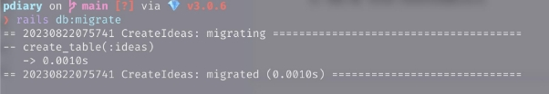
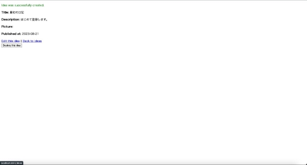
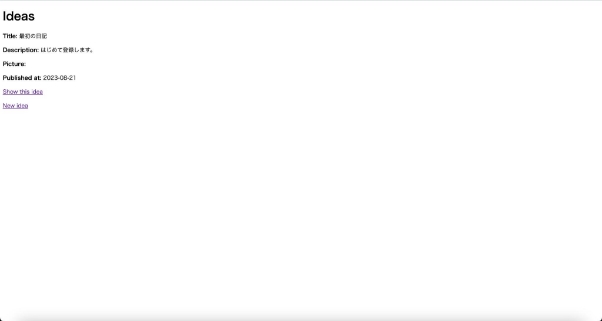

Webアプリケーションづくりの第一歩

Railsの機能を使ってみよう

`　`これから作っていくWebアプリケーションの名前を決めます。今回は、写真等の画像で投稿する 日記を作るので、『pdiary』という名前にします。作業ディレクトリとして、『myWebApp』というディ レクトリを作成し、pdiaryはその下に作成します。以下のコマンドを実行します。

`　`*rails \_7.0.4\_ new pdiary*

`　`こちらのrails new [アプリケーション名] コマンドを実行すると、アプリケーション名と同じ名前の ディレクトリが作成されます。今回の場合は、作業ディレクトリの中にpdiaryというディレクトリが作 成され、その中に必要なファイルが作成されています。先ほどのコマンドを実行した際に、ターミ ナルに表示されたものは「ファイルをインストールしました」というログになります。

`　`なお、必要なファイルが作成されたpdiaryのようなディレクトリは『**Rails**ルートディレクトリ』と呼 びます。

`　`Webアプリケーションの起動に最低限必要な準備ができたのでサーバーを起動してみましょう。

`　`*cd pdiary* # Railsルートディレクトリに移動 　*bin/rails server* # Webサーバーを起動

`　`ターミナルに表示されたメッセージの最後の行にUse Ctrl-C to stopが表示されたら、ブラウザ のアドレスバーに、*htt[p://localhost:3000/* を](http://localhost:3000/)*入力し、アクセスします。URLのドメイン名部分 (localhost)は、自分のコンピューターのことを表します。また、3000というのはポート番号を表して います。ポート番号とは、コンピューターがプログラムと通信するときに利用する番号で、Railsで はデフォルトで3000番のポートを利用します。

`　`サーバーを停止したい場合は、先ほどのコマンドを実行したターミナルでCtrl + Cにより、停止 可能です。

ディレクトリについて

`　`ディレクトリの種類について少し整理します。

- ホームディレクトリ

`　`コンピュータのログインユーザーが持っている、自由に利用できるディレクトリのこと。（ macOSの場合、/Users/ユーザー名）

- 作業ディレクトリ

`　`作業をするためのディレクトリ。今回の場合はmyWebAppを指している。

- Railsルートディレクトリ

`　`Railsアプリケーションのディレクトリの中で、一番上にあたるディレクトリ。今回の場合は pdiaryを指している。

できたファイルを確認しよう

`　`rails newコマンドで、ファイルが作成されたのでどのようなファイルがあるか、エディターを利用 して確認してみましょう。VS Codeを利用する場合、pdiary上で次のコマンドを実行します。

`　`*code .*

`　`そうすると、VS Codeが起動し、pdiaryの中のディレクトリ一覧が表示されます。エディターで開 いてみると様々なファイルができています。この中でもappディレクトリは、アプリケーションの中 心となるファイルが保存されているディレクトリになります。次の表はappディレクトリの中にある 各ディレクトリの役割についての説明です。

|ディレクトリ名|役割|
| - | - |
|assets|画像やCSSを格納するディレクトリ|
|channels|Webサーバーとブラウザ間の双方向リアルタイム通信に関するものを格納するディレ クトリ|
|controllers|コントローラー(MVCモデルのC)を格納するディレクトリ|
|helpers|ビューでの処理を共通にまとめたものを格納するディレクトリ|
|javascript|JavaScriptを格納するディレクトリ|
|jobs|サーバーで動作する一連の処理（ジョブ）に関するものを格納するディレクトリ|
|mailers|メール通信機能に関するものを格納するディレクトリ|
|models|モデル（MVCモデルのM）を格納するディレクトリ|
|views|ビュー（MVCモデルのV）を格納するディレクトリ|

日記を投稿する画面を作ってみよう

`　`前回でURLをブラウザに入力すると画面が表示される、最低限の機能をもつWebアプリケー ションをrails newコマンドで作りました。次はRailsの機能を使って日記を投稿する機能を追加し ていきます。

日記のデータ構造を考えよう

- 日記のタイトル
- 日記の内容
- 画像
- 投稿日

`　`このような項目をもつ日記を投稿します。また、データベースを利用して、日記を保存・管理する ようにします。

日記をデータベースに保存するための準備

`　`各項目のデータの種類から、データベースで管理するためのデータ型を決めます。データベー スでよく利用するデータ型には、次のようなものがあります。

|データ型|データベースで扱える情報|
| - | - |
|string|文字（最長が255文字までの文字）|

|text|文章（最長が256文字以上の文字）|
| - | - |
|integer|数値（整数）|
|boolean|真偽値（true/false）|
|date|日付|
|datetime|日時|

`　`先ほど記述した日記の項目がどれに当てはまるのか考えてみます。

- 日記のタイトル - 文字
- 日記の内容 - 文章
- 画像 - 画像ファイル？ → 文字
- 投稿日 - 日付

`　`画像ファイルについてですが、今回はWebアプリケーションで画像を表示するときには、画像 ファイルを保存したディレクトリの場所とファイル名（ファイルパス）を利用するため、『文字』で保 存することにします。

`　`これで日記の項目のデータ型は決まりました。データベースでは、項目をまとめてテーブルと呼 ばれる構造で管理します。管理するために、テーブルの名前をつける必要があります。Railsでは テーブルの名前と、テーブルの情報のやりとりを行うモデル名と関連付けが行われるようになっ ています。モデルのクラスは１つの日記の投稿の情報を扱うので単数系、テーブルは複数の日 記の投稿を管理するので、モデル名の複数形にするのが**Rails**の規約です。今回は、モデル名を 『Idea』、テーブル 名 を『ideas』とします。

`　`カラム名は、一般的にはアルファベット、数字や一部の記号を利用します。

|項目|カラム名|データ型|
| - | - | - |
|日記のタイトル|title|string|
|日記の内容|description|text|
|画像|picture|string(ファイルパス)|
|投稿日|published\_at|date|

`　`テーブルとカラムのイメージは次のようになります。

|日記のタイトル|日記の内容|写真|投稿日|
| - | - | - | - |
|旅行の写真|旅行に行ってきまし た。|Photo01.jpg|2022/11/01|
|文化の日の出来事|こんなことがありまし た。|Photo02.jpg|2022/11/03|

|今日のランチ|美味しいものを食べ ました。|Photo03.jpg|2022/11/05|
| - | :- | - | - |

scaffoldで日記投稿画面を作ろう

`　`『日記をデータベースに保存するための準備』で、日記のデータ構造を決めました。次は、日記 を一覧で見る・投稿する・編集する・削除する・参照する機能を作っていきます。 Railsのscaffold機能を利用します。以下のコマンドを実行します。

*bin/rails generate scaffold Idea title:string description:text picture:string published\_at:date* 　このコマンドをもう少し細かく分解すると次のようになります。

*bin/rails generate scaffold* 名前 カラム名*:*データ型 カラム名*:*データ型 *…*

投稿を管理するための名前（モデル名）を指定し、投稿の項目を『カラム名:データ型』として、複 数の項目をスペースで区切りながら指定します。

`　`scaffoldは『建築現場の足場』という意味があります。ひとつのモデルに対して、データを作成・ 更新・参照するために必要なひな形（テンプレート）を生成するようになっています。今回では、次 のようなものを生成します。

- Ideaをデータベースで管理するためのideasテーブルの定義
- Ideaを一覧で見る・投稿する・編集する・削除する・参照するためのひな形
- テストをするときに必要なひな形

`　`scaffold機能では、ひな形のファイルを生成するだけで、データベースにIdeaを管理するための テーブルは作成されていません。先ほど生成されたテーブルの定義ファイルを利用して、Ideaを 管理するテーブルをデータベース上に作成します。

`　`*bin/rails db:migrate*

`　`create\_table(:ideas)とメッセージが表示され、Ideaを管理するテーブルideasが作成されます。

`　`Ideaが作成されたことを確認するために、Webサーバーを起動し、http://lo[calhost:3000/ideas/ ](http://localhost:3000/ideas/)にアクセスしてみます。タイトルとして「Ideas」と、リンクとして「New idea」が表示されていたら pdiaryに日記を投稿する画面ができています。この一覧画面にある「New idea」リンクをクリック すると投稿画面が表示されます。

`　`日記の各項目、タイトル（title）・内容（description）・投稿日（published\_at）をそれぞれ入力して みましょう。画像は現段階は空白のままにします。

`　`入力できたら「Create Idea」ボタンで投稿できます。一覧画面に戻ることで先ほど投稿した日記 の情報が表示されています。

投稿完了画面

一覧画面

|画面|動作|遷移先画面|
| - | - | - |
|一覧画面|「New idea」リンクをクリック|投稿画面|
|一覧画面|「Show this idea」リンクをクリック|クリックした投稿の参照画面|
|参照画面|「Edit this idea」リンクをクリック|参照していた投稿の編集画面|
|参照画面|「Back to ideas」リンクをクリック|一覧画面|
|参照画面|「Destroy this idea」リンクをクリック|一覧画面（参照していた投稿が削除さ れて表示される）|
|投稿画面|「Back to ideas」リンクをクリック|一覧画面|
|投稿画面|「Create Idea」ボタンをクリック|参照画面（投稿画面で入力した内容 が表示される）|
|編集画面|「Show this idea」リンクをクリック|参照画面（編集画面で変更する前の 内容が表示される）|
|編集画面|「Back to ideas」リンクをクリック|一覧画面|
|編集画面|「Update Idea」ボタンをクリック|参照画面（編集画面で変更した内容に 更新されて表示される）|

参考書籍

江森真由美，やだけいこ，小林智恵. (2023/4/20). はじめてつくるWebアプリケーション 〜Ruby on Railsでプログラミングの第一歩を踏み出そう. ISBN: 978-4-297-13468-6
