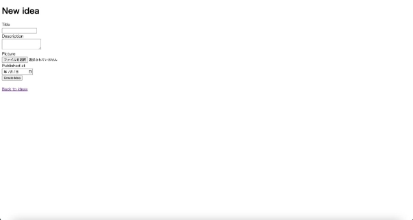

 画像ファイルをアップロードする機能を追加しよう

gemを使ってファイルアップロード機能を追加しよう

　ここでは、CarrierWaveというgemを使って、画像ファイルをアップロードする機能を追加してみましょう。

　Railsルートディレクトリの中にあるGemfileの最後の行に次の１行を追加します。

```
gem “carrierwave”, “~> 2.2.3”
```


追加したら、ターミナルで次のコマンドを実行します。 

```
bundle
```

bundleコマンドは、Gemfileに書いたgemファイルをインストールするコマンドです。このコマンドを実行すると次のようなメッセージが表示されます。


　bundleコマンドは、Gemfileに書いたCarrierWaveで利用しているgemも同時にインストールしてくれます。Carrierwaveだけでなく、他のいくつかのgemもインストールされています。

　Carrierwaveのインストールが終わったら、次のコマンドを実行します。このコマンドを実行することで、ファイルアップロードのために必要なディレクトリやファイルが作成されます。

```
rails generate uploader Picture
```


　Railsルートディレクトリからみて、app/uploadersの中にpicture\_uploader.rbというファイルが作成されたというメッセージです。

pdiaryでCarrierWaveを使えるようにしよう

　まず、app/models/idea.rbをエディターで開き、次のように変更します。


　追加した行は、Ideaクラスに、CarrierWaveのアップロード機能を追加するためのものです。

- アップロード先のファイルパスを保存する先は、ideasテーブルのカラム名pictureとする
- 先ほどコマンド実行して作成された、app/uploaders/picture\_uploader.rbで宣言されているPictureUploaderクラスの設定を利用する

　これで、pdiaryでCarrierWaveが使えるようになり、アップロード機能を追加する準備ができました。

投稿画面にファイルアップロード機能を追加しよう

　次に、投稿画面にファイルをアップロードするための選択機能を追加します。

まず、`rails server`でWebサーバーを起動しましょう。現在のpictureは文字が入力できる状態になっているため、この部分をファイル選択できるように変更していきます。 app/views/ideas/\_form.html.erbをエディターで開きます。

26行目付近にある、<%= form.text\_field :picture %>を変更します。


ページをリロードして確認してみると、ファイルを選択できる状態になっています。



アップロードしたファイルを見えるようにしよう

　Webサーバーを起動させたまま、app/views/ideas/\_idea.html.erbをエディターで開きます。14 行目にある<%= idea.picture %>を変更します。


一覧画面や参照画面で画像が表示されているか確認してみましょう。


選択した画像ファイルのプレビュー機能を追加しよう

　このままでは、一覧画面や参照画面では表示されますが、投稿画面などでは画像が表示されません。選択した画像ファイルが何かわかりやすいようにプレビュー機能を追加してみましょう。プレビュー機能を追加するにあたり、javascriptを使用します。今回はapp/javascriptに新しくideasというフォルダを作り、その下にpreview.jsというファイルを作ります。


　まず、画像をプレビューする場所を追加します。app/views/ideas/\_form.html.erbを開き、26行目あたりから次のように変更します。


　<%= form.file\_field :picture %>にid: “picture-input”を追加します。次にdiv要素を追加し、こちらにid=”picture-preview”を追加します。これらのidはjavascriptで要素を指定する際に必要になります。

　以上の変更が完了したら、先ほど作成したapp/javascript/ideas/preview.jsを開きます。開いたら以下のコードを追加します。

```js

document.addEventListener("DOMContentLoaded", function()

  const pictureInput = document.getElementById("picture-input");

  const picturePreview = document.getElementById("picture-preview");

  pictureInput.addEventListener("change", function() {

    const file = pictureInput.files[0];

    if (file) {

      const reader = new FileReader();

      reader.onload = function(event) {

      const img = document.createElement("img"); img.src = event.target.result; img.style.width = "600px"; picturePreview.innerHTML = ""; picturePreview.appendChild(img);

      }

      reader.readAsDataURL(file);

    } else {

      picturePreview.innerHTML = ""; }

  });

});

```

順に説明していきます。

- document.addEventListener("DOMContentLoaded", function()

　HTMLドキュメントのロードが完了した際に実行される関数を指定しています。ド　　　 キュメントの準備が整っていることを確認しています。

- const pictureInput = document.getElementById("picture-input");

　idが”picture-input”である要素を取得しています。先ほど変更した<%= form.file\_field :picture, id: “picture-input”%>です。

- const picturePreview = document.getElementById("picture-preview");

　idが”picture-preview”である要素を取得しています。こちらも先ほど追加したものです。画像のプレビューが表示される部分になります。

- pictureInput.addEventListener("change", function()

　ファイルが選択（変更）された際に実行される関数を設定しています。

- const file = pictureInput.files[0];

　選択されたファイルの情報を取得しています。

- const reader = new FileReader();

　ファイルを非同期的に読み込むためのAPI、`FileReader`オブジェクトを作成しています。

- reader.onload = function(event)

　ファイルの読み込みが完了した際に実行される関数を設定しています。ここでは、画像のプレビューを生成し、表示する処理が行われます。

- img.src = event.target.result;

　読み込んだファイルのデータを、img要素のsrc属性に設定しています。これにより、画像の表示が行われます。

- img.style.width = "600px";

　画像要素の幅を設定しています。先ほどの「アップロードしたファイルを見えるようにしよう」で600pxに設定したので、こちらも同じように設定します。

- picturePreview.innerHTML = "";

　画像をプレビューする要素内のコンテンツを空にしています。新しい画像を表示する際に古い画像を削除します。

- picturePreview.appendChild(img);

　生成した画像要素を、画像プレビュー要素に追加して表示します。

　app/javascript/application.jsを開き、import “./ideas/preview”という一文を追加し、モジュールを読み込みます。


ブラウザをリロードして投稿画面で画像ファイルを選択してみましょう


無事、プレビュー画像が表示されました。

参考書籍

江森真由美，やだけいこ，小林智恵. (2023/4/20). はじめてつくるWebアプリケーション 〜Ruby on Railsでプログラミングの第一歩を踏み出そう. ISBN: 978-4-297-13468-6
