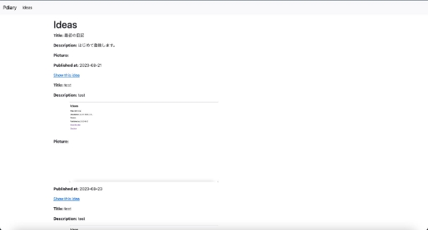
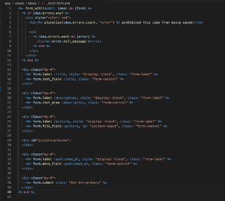
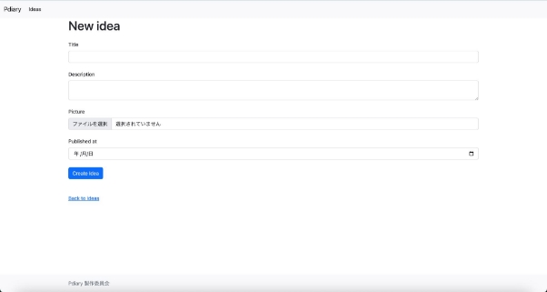

# デザインをきれいにしよう

## Railsのフロントエンド開発

　フロントエンドとは、ユーザーから直接見える部分を指します。Webアプリケーションの場合は、ブラウザで表示されている画面に相当します。（ユーザーから見えない部分は、バックエンドやサーバーサイドと呼ばれます。）

　Railsのフロントエンドは、HTML・CSS・JavaScriptを利用して作られています。


|名前|読み方|役割|
| - | - | - |
|HTML|エイチティーエムエル|文書構造|
|CSS|シーエスエス|画面デザイン|
|JavaScript|ジャバスクリプト|画面の動作や振る舞い|

　Railsの場合を例にしてみます。ブラウザからWebアプリケーションへのアクセスがあると、app/viewsの中にあるファイルを元にHTMLが生成され、ブラウザに表示されます。CSSはapp/assets/stylesheetsの中にあるCSSファイルが、JavaScriptはapp/javascriptの中にあるJavaScripファイルがブラウザで利用されます。

## トップページを設定しよう

　まず見た目を整える前に、トップページを設定してみましょう。Webサーバーを起動し、 http://localhost:3000/ にアクセスしてみましょう。RailsとRubyのバージョンが画面に表示されます。

　URLのパスで、/ でアクセスするパスのことを、ルートパスといいます。そして、ルートパスでアクセスするページは、一番最初にユーザーへ見せたい内容を表示するのが一般的です。pdiaryでは一覧画面を表示するようにします。

　決められたURLのパスにアクセスした時、Webアプリケーション内でどのような処理を行うかという設定は、config/routes.rbで管理しています。Webアプリケーションでの具体的な動作は、コントローラーのファイル内に、メソッドとして定義します。そして、config/routes.rbで、URLとコントローラー・アクションの紐付けを実施しています（ルーティングといいます）。実際にconfig/routes.rbをエディターで開いてみましょう。

    resources :ideas![ref1]

　こちらの行に注目します。この１行を書くだけで、次のようなパスと、コントローラー・アクションの紐付けが設定されます。


|HTTPリクエストメソッド|パス|<p>コントローラー＃アク</p><p>ション</p>|<p>コントローラー＃アク</p><p>ション</p><p>役割</p>|
| :-: | - | - | - |
|GET|/ideas(.:format)|ideas#index|一覧画面を表示する|
|POST|/ideas(.:format)|ideas#create|ideaを作成する|
|GET|/ideas/new(.:format)|ideas#new|投稿画面を表示する|
|GET|/ideas/:id/edit(.:format)|ideas#edit|編集画面を表示する|
|GET|/ideas/:id(.:format)|ideas#show|参照画面を表示する|
|PATCH|/ideas/:id(.:format)|ideas#update|Ideaを更新する|
|PUT|/ideas/:id(.:format)|ideas#update|Ideaを更新する|
|DELETE|/ideas/:id(.:format)|ideas#destroy|Ideaを削除する|

　それでは、ルートパスと、コントローラー・アクションの紐付けを設定してみましょう。config/routes.rbを次のように変更して保存します。

```ruby
  Rails.application.routes.draw do

    root to: redirect('/ideas')

    resources :ideas

    # Define your application routes per the DSL in https://guides.rubyonrails.org/routing.html

    # Defines the root path route ("/")
    # root "articles#index"

  end
```

　追加した行で、「ルートパス / へのアクセスを、/ideasへ転送する」ということを意味しています （この転送のことをリダイレクトといいます）。今回の場合は、「http://localhost/3000 へのアクセスをhttp://localhost/3000/ideas/ へ転送する」ということになります。

## Bootstrapを導入しよう

　ここでは、HTMLとCSSを利用して画面のデザインを整えていきましょう。しかし、何もない状態からCSSをイチから書いて、デザインを作っていくのは大変です。このCSSを簡単に使えるよう、準備されているライブラリがあります（このようなライブラリのことを、CSSフレームワークといいます）。CSSフレームワークは数多くありますが、今回はその中でも有名なBootstrapを利用して、画面のデザインを整えていきます。

　Bootstrapを利用するために、CDNを利用します。また、全ての画面でBootstrapを利用したいのでapp/views/layouts/application.html.erbに情報を追加します。 app/views/layouts/application.html.erbは、Webアプリケーション全体に影響を及ぼす構成を記述するファイルになります。

早速Bootstrapを導入していきましょう。画面の見た目を整えるためのCSSと、メニューなどの動きをつけるためのJavaScriptの２つのCDNを利用します。Bootstrapの公式サイト、「Download-CDN via jsDelivr」 <https://getbootstrap.com/docs/5.2/getting-started/download/#cdn-via-jsdelivr> にあります。「<link href=」で始まる行と、「<script src=」で始まる行の２行記載されている欄の右側にあるクリップボードのマークをクリックしてCDNをコピーします。

　まずは、CSSのCDNの設定です。app/views/layouts/application.erbの中にある<%= stylesheet\_link\_tag “application”, “data-turbo-track”: “reload” %>の次の行に、先ほどコピーしたCDNのうち、<link href=で始まる行だけを追加して保存します。

　次に、JavaScriptのCDNの設定です。app/views/layouts/application.erbの</body>の一つ前の行に先ほどコピーしたCDNのうち<script src=で始まる行だけを追加して保存します。

　以下が追加した結果です。

```
  <!DOCTYPE html>

    <html>

      <head>

        <title>Pdiary</title>

        <meta name="viewport" content="width=device-width,initial-scale=1"> <%= csrf\_meta\_tags %>

        <%= csp\_meta\_tag %>

        <%= stylesheet\_link\_tag "application", "data-turbo-track": "reload" %>

        <link href="https://cdn.jsdelivr.net/npm/bootstrap@5.2.3/dist/css/bootstrap.min.css" rel="stylesheet" integrity="sha384-rbsA2VBKQhggwzxH7pPCaAqO46MgnOM80zW1RWuH61DGLwZJEdK2Kadq2F9CUG65" crossorigin="anonymous">

        <%= javascript\_importmap\_tags %>

      </head>

      <body>

        <%= yield %>

        <script src="https://cdn.jsdelivr.net/npm/bootstrap@5.2.3/dist/js/bootstrap.bundle.min.js" integrity="sha384-kenU1KFdBIe4zVF0s0G1M5b4hcpxyD9F7jL+jjXkk+Q2h455rYXK/7HAuoJl+0I4" crossorigin="anonymous"></script>

      </body>

  </html>
```

導入後ブラウザをリロードし、表示されているフォントや、文字の配置が少し異なっていることを確認してみましょう。


## ナビゲーションバーとフッターを作成しよう

### ナビゲーションバー

ナビゲーションバーは、Webアプリケーションで、各機能にアクセスするためのメニューのことを指します。pdiaryでは、Bootstrapのサンプルプログラムを参考にして、画面上部にナビゲーションバーを作成してみましょう。

app/views/layouts/application.html.erbをエディターで開き、<body>の次の行に、次のプログラムを追加します。

```
  <nav class="navbar navbar-expand-lg bg-light">

    <div class="container-fluid">

      <a class="navbar-brand" href="#">Pdiary</a>

      <button class="navbar-toggler" type="button" data-bs-toggle="collapse" data-bs-target="#navbarNav" aria-controls="navbarNav" aria-expanded="false" aria-label="Toggle navigation">

        <span class="navbar-toggler-icon"></span>

      </button>

      <div class="collapse navbar-collapse" id="navbarNav">

        <ul class="navbar-nav">

          <li class="nav-item">
          <a class="nav-link active" aria-current="page" href="/ideas">Ideas</a>
          </li>

        </ul>

      </div>

    </div>

  </nav>
```

追加できたらブラウザにアクセスして確認してみましょう。


### フッター

フッターはWebページの一番下にある情報領域のことを指します。pdiaryでは、画面の下部にコピーライトを表示するようにしてみましょう。

まず、app/views/layouts/application.html.erbを開き、<%= yield %>の次の行に、次のプログラムを追加して保存します。

```
  <footer class="footer mt-auto py-3 bg-light">

    <div class="container">

    <span class="text-muted">Pdiary 製 作 委 員 会</span> </div>

  </footer>
```

そして、\<html>と\<body>に、属性を追加して保存します。

```
  <!-- ↓html —->

  <html class="h-100">

  <!-- ↓body —->

  <body class="d-flex flex-column h-100">
```

ここまでの変更でapp/views/layouts/application.html.erbは以下のようになります。ブラウザも確認してみましょう。


## 各画面の見た目をきれいにしよう

### 一覧画面と投稿画面

ここまでで、ナビゲーションバーとフッターが表示されるようになりました。これから、一覧画面・投稿画面の見た目を変更していきましょう。

まず、[http://localhost:3000/ ](http://localhost:3000/)でアクセスする一覧画面ですが、よく見ると左側に余白がないので余白を持たせましょう。app/views/layouts/application.html.erbを開き、<%= yield%>の部分を次のように変更します。

```
  <div class="container">

  <%= yield %>

  </div>
```


余白ができました。

### 投稿画面と編集画面

まずは、投稿画面であるapp/views/ideas/new.html.erbをエディターで開いて内容をみてみます。
```
  <h1>New idea</h1>

  <%= render "form", idea: @idea %> <br>

  <div>

  <%= link\_to "Back to ideas", ideas\_path %> </div>
```

`<%= render "form", idea: @idea %>`

この行がポイントです。ここで、app/views/ideas/\_form.html.erbという名前のファイルの内容が表示されるようになります。

これは部分テンプレートという仕組みを利用しています。部分テンプレートは、ビューをいくつかのファイルに分割したものです。例えば、複数の箇所で利用するビューのプログラムを、部分テンプレートとして、別のファイルとして書き出しておきます。別のファイルに分けておくことで、rederメソッドを使ってプログラムを利用したい箇所で簡単に呼び出すことができます。

今回のapp/views/ideas/\_form.html.erbは、編集画面のapp/views/ideas/edit.html.erbでも呼び出しています。

```
  <h1>Editing idea</h1>

  <%= render "form", idea: @idea %> <br>

  <div>

  <%= link\_to "Show this idea", @idea %> |

  <%= link\_to "Back to ideas", ideas\_path %> </div>
```

app/views/ideas/new.html.erbと同じように<%= render “form”, idea: @idea %があります。今回の投稿画面と編集画面では、部分テンプレートである、app/views/ideas/\_form.html.erbを変更すれば、どちらにもその変更が反映されることになります。エディターで開いて、次のようにプログラムを変更して保存してみましょう。



これで、http://localhost:3000/ideas/new/ にアクセスすると、整形された画面が表示されるはずです。確認してみましょう。



これで見た目もある程度整いました。最後にこの前追加したPreviewの欄も作成します。

<div id="picture-preview">

</div>

こちらのapp/views/ideas/\_form.html.erbの上の行を先ほどやったものと同じように

```
  <div class="my-4">

    <%= form.label :preview, style: "display: block", class: "form-label" %>
    <div class="row">

      <div class="col-md-4" id="picture-preview">

      </div>

    </div>

  </div>
```

このように変更します。ブラウザを更新して確認してみましょう。


Previewの欄が表示されることが確認できました。

参考書籍

江森真由美，やだけいこ，小林智恵. (2023/4/20). はじめてつくるWebアプリケーション 〜Ruby on Railsでプログラミングの第一歩を踏み出そう. ISBN: 978-4-297-13468-6
