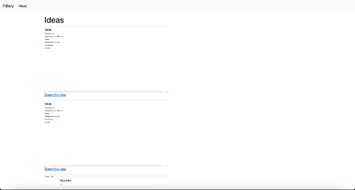
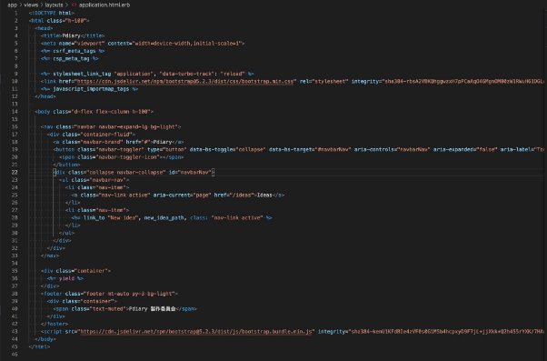
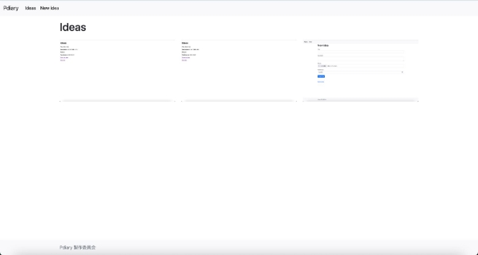

フロントエンド開発の大切な３つの要素

HTML

`　`**HTML**はHyperText Markup Languageの略で、文章構造を記述するための言語（マークアップ 言語です）です。文章構造の例として、見出しがあり、次に概要、そして詳細な内容があるといっ た感じです。以下のタイトル部分を例にします。

*<title>*タイトルです*</title>*

`　`タグは、山かっこで囲まれた部分です。要素名（文章構造の種類を表すもの）が山かっこに入っ たものが開始タグとなり、要素名の前にスラッシュをつけたものが、終了タグとなります。先ほど の例だと、titleが要素名、<title>が開始タグ、</title>が終了タグになります。そして、それらに挟 まれた「タイトルです」が内容です。その全てを含めた全体を要素と呼びます。

`　`HTMの要素には、次のようなものが代表的にあります。

|要素名|説明|
| - | - |
|html|この文書がHTMLであることを表します。HTMLの要素は、全て <html>〜</html>の中に配置されます。|
|head|この文書に関する作成者や作成日時などの情報（パラメータ）を 表します。|
|title|Webページのタイトルを表します。ブラウザのタブやタイトルバー に表示されます。|
|body|HTMLのコンテンツ（Webページで表示する内容）を表します。|
|nav|メニューや目次といった、他のページや同一ページ内へのリンク （ナビゲーションリンク）を表します。|
|p|一つの段落を表します。|
|h1,h2,h3,h4,h5,h6|見出しを表します。数字が小さければ小さいほど、大きな見出し になります。|
|table|表形式のデータを表します。表の具体的な構造はth, tr, td要素を 利用して表現します。|
|th|表のヘッダーを表します。<table>〜</table>の中で利用します。|
|tr|表の行を表します。<table>〜</table>の中で利用します|
|td|表の行の中の一つのデータを表します。<table>〜</table>の中 で利用します。|
|div|汎用性なひとかたまりのコンテンツであることを表します。|

`　`また、HTML要素には属性を設定できます。属性はHTML要素の追加情報を設定するもので、 属性名＝”属性値”という形で表すことができます。 また属性は複数設定することができます。例えば、次のように設定します。

*<h1 class=”main-header” id=”main01”>*見出しの部分です*</h1>*

`　`HTMLの属性には様々なものがありますが、id・classはCSSでよく利用される属性でもありま す。idは、HTMLファイル内で、要素を識別するための属性値を設定するものです。HTMLファイ ル内でidの値は、同じ値を重複せずに設定する必要があります。classは、HTMLファイル内で、 特定のグループを表す属性値を設定するものです。スペース区切りで複数の値が設定可能で す。

HTML要素の親子関係

`　`HTMLは要素の入れ子構造になっていることもあり、親子関係や兄弟関係などで要素を指定し て説明することも多いです。

*<html>*

`　`*<head>*

`　　`*<title>*タイトルです*</title>* 　*</head>*

`　`*<body>*

`　　`*<h1>*見出しの部分です*</h1>* 　　*
*段落その１です*
*

`　　`*
*段落その２です*
*

`　`*</body>*

*</html>*

`　`入れ子要素の中にあるものを子要素、自分が入れ子として含まれているすぐ上の要素を親要 素といいます。body要素の場合は、h1要素・p要素が子要素、html要素が親要素となります。ま た、同じ親要素に含まれていて、同じ階層の要素を兄弟要素といいます。body要素の場合は head要素が該当します。

CSS

`　`CSSは、Cascading Style Sheetsの略で、HTMLに対してスタイル（見た目）を設定するために 利用される言語です。HTMLの要素や属性に対して、文字色や背景色といった色や、ブラウザの 表示位置やレイアウトなどを設定できます。

h1 {

`　`color: red; }

`　`こういったスタイルを設定する対象のことをセレクターといいます。この例ではHTMLのh1要素 に対して文字色を赤色に設定しています。また、HTMLの要素だけでなく、属性に対しても設定が 可能なセレクターもあります。代表的なセレクターを次に記載します。

|セレクターの種類|セレクターの書き方（例）|説明|
| - | - | - |
|要素型セレクター|h1|HTML要素に対してスタイルを設定しま|

|||す。|
| :- | :- | - |
|クラスセレクター|.main-header|HTMLの属性名がclassの属性に対して スタイルを設定します。|
|IDセレクター|# main01|HTMLの属性名がidの属性に対してスタ イルを設定します。|
|属性セレクター|h1[class^=main]|HTMLの指定された属性、または条件で 設定した属性値に対してスタイルを設定 します。|

JavaScript

`　`JavaScriptは、主にブラウザの中で動作するプログラミング言語です。Webアプリケーションで 画面の動作や振る舞いを設定するのに欠かせないものです。また近年はブラウザの中だけでな く、サーバーサイド側のアプリケーションや、Windows・macOSのアプリケーションとしても幅広く 利用されるようになっています。実は、今まであなたが利用してきたエディターであるVSCodeも JavaScriptを利用して作成されています。

一覧画面と参照画面のデザインを変えよう

`　`pdiaryで、Instagramのデザインを参考にして、一覧画面は画像が横に3枚ずつ並ぶデザイン に、参照画面は左側に画像、右側に日記の詳細情報を表示するデザインに変更していきましょ う。

一覧画面のデザインを変えよう

`　`まずは一覧画面で画像を横に3枚ずつタイルのように並べるようにしてみましょう。 app/views/ideas/index.html.erbをエディターで開いてみます。

<%= notice %>
 <h1>Ideas</h1>

<% @ideas.each do |idea| %>

<%= render idea %>

<%= link\_to "Show this idea", idea %> 

<% end %>

<%= link\_to "New idea", new\_idea\_path %> <%= render idea %>

renderがあるのでapp/views/ideas/\_idea.html.erbをエディターで開いてみましょう。

">

<strong>Title:</strong> <%= idea.title %>

<strong>Description:</strong> <%= idea.description %>

<strong>Picture:</strong>

<%= image\_tag(idea.picture\_url, width: '600px') if idea.picture.present? %> 

<strong>Published at:</strong> <%= idea.published\_at %>

`　`こちらは、日記のタイトル・日記の内容・画像・投稿日を表示している部分テンプレートです。こ の部分テンプレートを変更して、画像だけを表示できるようにするとよさそうです。 app/views/ideas/show.html.erbでも同じ部分テンプレートを呼び出しており、部分テンプレートの 部分を変更してしまうと一覧画面と参照画面両方とも変更されてしまうので、 app/views/ideas/index.html.erbの部分テンプレート呼び出しをやめて、画像を表示するように変 更していきましょう。

`　`部分テンプレートを次のように変更します。

<%= notice %>
 <h1>Ideas</h1>

<% @ideas.each do |idea| %>

<%= image\_tag(idea.picture\_url, width: '600px') if idea.picture.present? %> 

<%= link\_to "Show this idea", idea %>

<% end %>

<%= link\_to "New idea", new\_idea\_path %>

`　`確認してみましょう。

`　`登録した画像が縦に並んで表示されています。ここから横に3枚ずつ並ぶようにしていきましょ う。次のように変更します。

<%= notice %>
 <h1>Ideas</h1>

<% @ideas.in\_groups\_of(3, false) do |idea\_group| %>

<% idea\_group.each do |idea| %>

<%= image\_tag(idea.picture\_url, width: '600px') if idea.picture.present? %>

<%= link\_to "Show this idea", idea %>

<% end %>

<% end %>

<%= link\_to "New idea", new\_idea\_path %>

`　`変更できたら確認してみましょう。

`　`横に並ぶようになりました。しかし、重なって表示されてしまっています。これはimage\_tagメソッ ドの引数の影響です。

`　`image\_tagメソッドを利用した時に、２つ目の引数にwidth: ‘600px’と記載しています。これは画 像の横幅を最大600pxで表示する、という意味になります。今回アップロードしている画像ファイ ルは、全て横幅が600pxよりも大きいものだったため、画像を表示するときの最大の横幅である 600pxで表示しようとした結果、隣どうしの画像と重なりあっている状態になっています。

`　`そこで、２つ目の引数をwidth: ‘100%’に変更してみます。これにより、画像を表示するときの最 大の横幅が、HTMLの親要素の横幅いっぱいに表示されるため、お互いの画像が重ならないよ うになります。

`　`重ならずに画像が表示されていることが確認できました。

`　`最後にリンク部分を変更しましょう。まずは、画像の下に表示されている「Show this idea」リン クを削除して、画像にリンクを設定するように変更します。app/views/ideas/index.html.erbを開 き、次のように変更します。

<%= notice %>
 <h1>Ideas</h1>

<% @ideas.in\_groups\_of(3, false) do |idea\_group| %>

<% idea\_group.each do |idea| %>

<%= link\_to idea do %>

<%= image\_tag(idea.picture\_url, width: '100%') if idea.picture.present? %>

<% end %>

<% end %>

<% end %>

<%= link\_to "New idea", new\_idea\_path %>

`　`「Show this idea」リンクが削除されています。

`　`そして、画像下にある「New idea」リンクは上部のナビゲーションバーに移動してしまいましょ う。

`　`app/views/ideas/index.html.erbの最後の行にある<%= link\_to “New idea”, new\_idea\_path%>を削除して保存します。そしてナビゲーションバーに移動したいので、 app/views/layouts/application.html.erbを開いて、次のように変更します。

「New idea」リンクがナビゲーションバーに移動しています。

参照画面のデザインを変えよう

`　`次に参照画面で、左側に画像、右側に日記の詳細情報を表示するように変更してみましょう。 参照画面は、app/views/ideas/show.html.erbになります。

<%= notice %>
 <%= render @idea %>

<%= link\_to "Edit this idea", edit\_idea\_path(@idea) %> | <%= link\_to "Back to ideas", ideas\_path %>

<%= button\_to "Destroy this idea", @idea, method: :delete %> 

`　`部分テンプレートがあるのでapp/views/idea/\_idea.html.erbを開きます。そして、次のように変 更 しましょう。

" class="row">

<%= image\_tag(idea.picture\_url, width: '100%') if idea.picture.present? %> 

<h1>

<%= idea.title %>

</h1>

<time class="badge rounded-pill bg-info text-dark">

<%= idea.published\_at %>

</time>

<%= idea.description %> 

 

`　`要所要所へ、要素と属性を追加しました。ページを更新して確認してみましょう。

`　`画像が左側へ、日記の詳細が右側に表示され、タイトルの文字が大きくなり投稿日が青色で囲 まれるようになりました。

`　`最後に画像下のリンク部分を変更しましょう。app/views/ideas/show.html.erbを次のように変更 します。

<%= notice %>
 <%= render @idea %>

<%= link\_to "Edit this idea", edit\_idea\_path(@idea), class: "btn btn-info" %>

<%= button\_to "Destroy this idea", @idea, method: :delete, class: "btn btn-danger ms-3" %>

`　`「Back to ideas」リンクは、ナビゲーションバーにも同じ機能の「ideas」リンクが存在するので削 除しました。「Edit this idea」は水色、「Destroy this idea」は赤色のボタンにします。

`　`ブラウザをリロードして確認してみましょう。

`　`意図した通りに変更できたこと確認できました。 参考書籍

江森真由美，やだけいこ，小林智恵. (2023/4/20). はじめてつくるWebアプリケーション 〜Ruby on Railsでプログラミングの第一歩を踏み出そう. ISBN: 978-4-297-13468-6
