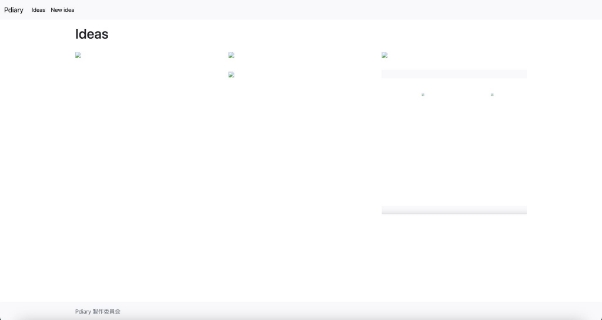
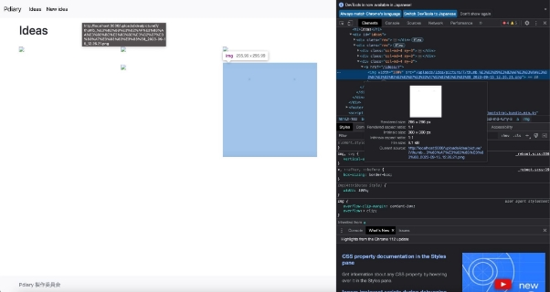

# サムネイルを作成・表示しよう

　「4-2. 一覧画面と参照画面のデザインを変えよう」で、デザインを変更するときに、一覧画面や参照画面で、画面に表示するときの画像の横幅サイズを指定しました。

　アップロードした画像ファイルをブラウザで表示する時は、指定された幅のサイズに縮小・拡大して表示する仕組みになっています。表示する縦・横の大きさが小さくなったとしても、アップロードした画像をそのまま読み込んで処理を行っています。そのため、表示される画像が増えれば増えるほど、さらに画像ファイルが大きいサイズになればなるほど、処理に時間がかかってしまいます。一覧画面のように、多くの画像を表示する画面は、表示し終わるまでに時間がかかり「遅いな」と感じてしまう可能性があります。

　そこで、実際の画像ファイルよりサイズを小さくした画像であるサムネイルを作成して、一覧画面ではサムネイルを表示するようにしていきましょう。

## サムネイル作成に必要なアプリケーション・gemをインストールしよう

　「3-3. 画像ファイルをアップロードする機能を追加しよう」で画像ファイルをアップロードするためにCarrierWaveというgemをインストールしました。このgemは画像ファイルをアップロードできるようにするだけでなく、画像ファイルのサイズを指定してサムネイルを作ることもできます。今回はCarrierWaveで画像ファイルの処理を行うためには、次の２つが必要です。

・画像ファイルを表示・操作するアプリケーションのImageMagick

・ImageMagickをCarrierWaveから利用するためのgemのMiniMagick

　ImageMagickは、すでに１章でインストールしたので、ここではgemのMiniMagickをインストールします。Railsルートディレクトリにある、Gemfileをエディターで開くと、Gemfileの一番最後の行に*gem “carrierwave”, “~> 2.2.3”*があります。その下に１行追加します。

```
gem "carrierwave", "~> 2.2.3"
gem "mini\_magick", "~> 4.11.0"
```

　Webサーバーを再起動しbundleコマンドを実行します。これでMiniMagickのインストールが完了しました。

## サムネイルを表示してみよう

　次に、サムネイルを作成できるようPictureUploaderクラスの設定を変更します。app/uploaders/picture\_uploader.rbを開きます。

　まずはMiniMagickを利用できるようにするため、# include CarrierWave::MiniMagickのコメントアウトを削除します。

```
class PictureUploader < CarrierWave::Uploader::Base

# Include RMagick or MiniMagick support:
# include CarrierWave::RMagick

include CarrierWave::MiniMagick
```

　次に、サムネイルを作成するための設定を追加します。31行目付近に次のようなコメントアウト された設定があるので、この部分を変更します。

```
# Create different versions of your uploaded files:

process resize\_to\_fill: [300, 300, "Center"]

end
```

　次に、一覧画面でサムネイルを表示するようにしましょう。app/views/index.html.erbをエディターで開き、画像を表示するimage\_tagの引数部分を変更します。

```

<p style="color: green"><%= notice %></p> <h1>Ideas</h1>

<div id="ideas">

  <% @ideas.in\_groups\_of(3, false) do |idea\_group| %>

    <div class="row">

      <% idea\_group.each do |idea| %>

        <div class="col-md-4 my-3">

          <%= link\_to idea do %>

            <%= image\_tag(idea.picture\_url(:thumb), width: '100%') if idea.picture.present? %>

          <% end %>

        </div>

      <% end %>

    </div>

  <% end %>

</div>
```

　これで、サムネイルを表示できるようになりました。この状態で一度確認してみましょう。 一覧画面の画像が表示されなくなっているはずです。

　

　ここで何も表示されないのは、今までに投稿した画像のサムネイルが作成されていないためで す。サムネイルは、日記を投稿するときに作成されます。

　そこで、まずは投稿画面で新しい画像を投稿してみましょう。投稿した後に一覧画面を表示する と、1枚だけサムネイルが表示されているはずです。



　ここで、画像のサイズがどのようになっているかを確認してみましょう。一覧画面で、サムネイルを右クリックして、表示されるメニューの一番下にある「検証」をクリックします。



　この中の「Intrinsic size」と「File size」を見てみましょう。Intrinsic sizeは、実際の画像サイズを、File sizeはファイル容量の大きさを示しています。ここでは、幅300px、高さ300px、ファイルサイズは35.1KBとなっています。

　今度は参照画面で、画像を検証してみましょう。サムネイルをクリックし、参照画面へ移動します。先ほどの同じように画像の詳細情報を確認してみましょう。


　今回は、幅3456px、高さ1842px、ファイルサイズは168KBとなっています。一覧画面のサムネイルがこれよりも小さく作成されていることがわかります。

参考書籍

江森真由美，やだけいこ，小林智恵. (2023/4/20). はじめてつくるWebアプリケーション 〜Ruby on Railsでプログラミングの第一歩を踏み出そう. ISBN: 978-4-297-13468-6
