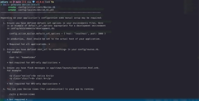

# gemを使ってログイン機能を追加しよう

## deviseとは

　deviseは、Railsアプリケーションにユーザー登録・ログイン / ログアウト・パスワード変更などを 簡単に追加できるgemで、ログイン機能を追加する時にもっとも多く利用されています。

## deviseのインストール

　それでは早速pdiaryにdeviseをインストールしてみましょう。CarrierWaveを追加したときのよう にdeviseを追加してみましょう。まず、Gemfileの最後の行に次の１行を追加します。

```
gem “devise”, “~> 4.8.1”
```

　追加したら、ターミナルで次のコマンドを実行してみましょう。

```
bundle
```

　次のようなメッセージが表示されたら、deviseのインストールは完了です。


## deviseのセットアップ

　次は、deviseの設定ファイルを作成・設定していきましょう。ターミナルで次のコマンドを実行し ます。

```
rails generate devise:install # deviseの設定ファイルを生成
```

　するとターミナルに、新規で作成されたファイルのメッセージと英語の文章が表示されます。



　この１〜４の英語の文章は、deviseを利用するために必要な設定を教えてくれているメッセージ です。説明をしていきますが、ここで変更が必要なのは３のみとなります。

### メッセージ１：環境別のdefault\_url\_optionsを確認する（任意）

　deviseには、ユーザー登録時やパスワード変更時に、メールを送信する機能がついています。 そのメールに記載するアプリケーションURL（ドメイン名とポート番号）の設定を default\_url\_optionsで行います。今回はメールを送信する機能は使用しませんが、設定方法を 確認しておきます。

　Railsでは、環境別の設定を、キーワードで区別して行えるようになっています。


|環境|キーワード|説明|
| - | - | - |
|開発環境|development|開発を行う環境。プログラムを書いている環境|
|本番環境|production|インターネット上に公開されたときの本番環境|
|テスト環境|test|テストを行う環境|

　default\_url\_optionsは、この環境別に設定が行えるようになっています。

　環境別の設定ファイルは、config/encironmentsディレクトリの中に保存されています。 config/environments/development.rbに開発環境の設定が記載されているので、エディターで開 きます。

　最後の行のendの上にメッセージの指示通りに追加します。開発環境のURLから、ドメイン名 = localhost、ポート番号 = 3000を指定します。

```ruby
require "active\_support/core\_ext/integer/time"
    Rails.application.configure do

（中 略）

    config.action\_mailer.default\_url\_options = { host: 'localhost', port: 3000 } end
```

### メッセージ２：config/route.rbのルートパスを確認する（任意）

　deviseのログイン機能では、ログインが成功すると、ユーザー名とパスワードを入力していたロ グイン画面からルートパスに設定してある画面へリダイレクト（転送）されるようになっています。 　ここで、ルートパスについて、もう一度確認してみましょう。3-4にある「トップページを設定しよう」 で、config/route.rbでルートパスの設定を次のように行います。

```
root to: redirect(‘/ideas’)
```

　これは、ルートパス（/, URLではhttp://localhost:3000/）にアクセスすると、日記の一覧画面（ /ideas）にリダイレクトするという設定でした。pdiaryでは、このルートパスの設定で、ログインが成 功すると日記の一覧画面が表示されるようになります。

### メッセージ３：app/views/layouts/application.html.erbのフラッシュメッセージ の表示を確認する（必須）

　3-2にある「scaffoldで日記投稿画面を作ろう」で作成した画面では、日記の投稿・更新・削除を 行ったときに、画面上部にメッセージが表示するようになっていました。このメッセージは、表示さ れている画面から他の画面に移動すると消えてしまいます。

　このように、表示されている画面から他の画面に移動すると消えるメッセージのことをフラッシュ メッセージといいます。deviseでは、ログインする時に入力したユーザー名とパスワードが一致し ない場合エラーメッセージや、ログインした時のログイン成功のメッセージをフラッシュメッセージ で表示できます。

　フラッシュメッセージを表示できるようにしておきましょう。ナビゲーションバーを設定した app/views/layouts/application.html.erbに追加して、Webアプリケーション全体で表示できるよう にしておきます。app/views/layouts/application.html.erbをエディターで開き、<%= yield %>の上 の行に、次のプログラムを追加します。

```html
<p class="notice"><%= notice %></p>
<p class="alert"><%= alert %></p>
```

　フラッシュメッセージには、日記の投稿・更新の成功や、ログイン成功などの通知メッセージ（ notice）と、ログインエラーやユーザー登録エラーなどの警告メッセージ（alert）の２種類がありま す。追加したプログラムで、noticeメッセージとalertメッセージが表示できるようになります。

　もう少し詳しく見ていきましょう。\<p>の開始タグから\</p>の終了タグで囲まれた次のプログラム が、フラッシュメッセージを表示している部分になります。

　pタグのもつ属性名がclassで、属性名をBootstrapで指定されている値（noticeまたはalert）の 属性を指定することで、フラッシュメッセージの種類別（notice、alert）に表示を変更しています。 <%= notice %>と<%= alert %>は、フラッシュメッセージを返すメソッドを呼び出していて、ここで メッセージを表示されるようになっています。

　最後に、日記の一覧画面と参照画面にフラッシュメッセージを表示する箇所が残っているので、 削除します。まず、一覧画面のapp/views/ideas/index.html.erbと参照画面の app/views/ideas/show.html.erbをエディターで開いて、１行目付近にある次の行を削除します。

```html
<p style="color: green"><%= notice %></p>
```

### メッセージ４：deviseのビューをカスタマイズをする（後述）

　deviseにはユーザー登録画面・ログイン画面など、deviseの機能で使用する画面のテンプレー トがあらかじめ用意されています。ビューのカスタマイズはChapter5-5で説明します。

　1~4のdeviseのメッセージに記載されていた設定は、これで以上です。

### turbo-railsに対応する

　Rails 7.0.0以降、JavaScriptを書かずにフロントエンドを開発するためのturbo-railsというgem が標準でインストールされるようになりました。

　deviseの設定は、config/initializers/devise.rbに書かれています。config/initializers/devise.rb を開き、260行目付近にある、次の記述を変更します。

```ruby
config.navigational\_formats = ['\*/\*', :html] # 変更前
config.navigational\_formats = ['\*/\*', :html, :turbo\_stream] # 変更後
```

　これでdeviseのセットアップは完了です。

## ユーザー情報を使えるようにしよう

　ログイン機能を追加するには、そのWebアプリケーションにログインできるユーザー情報をデー タベースに保存しておく必要があります。このユーザー情報は、Userという名前のモデル名を利 用することが多いので、本書でもUserを使っていきます。モデル名は単数形、テーブル名は複数 形にするのがRailsの規約なので、テーブル名はusersテーブルになります。

　deviseのログイン機能とユーザー情報のモデル（Userモデル）の紐付けを行います。ターミナル で次のコマンドを実行します。


　先ほどのコマンドでは、次のファイルの作成と、定義を追加しています。

- ユーザー情報をデータベースで管理するためのusersテーブル定義ファイル
- ユーザー情報のモデル（Userモデル）のクラスファイル
- テストをするときに必要なひな形ファイル
- deviseのログイン機能に必要なルーティング定義

　一つ一つ確認してみましょう。

### ユーザー情報をデータベースで管理するためのusersテーブル定義ファイルの反映

　db/migrate/20221106122855\_devise\_create\_users.rbは、ユーザー情報をデータベースで管 理するためのusersテーブルを作成する定義ファイルです。3-2では、scaffoldコマンド実行時に、 次のようにテーブルに保存するカラム名とデータ型を指定して実行しました。

　しかし、今回実行したコマンドでは、usersテーブルのカラム名やデータ型は指定していません。 これは、deviseでユーザー情報を管理するために必要な情報を自動で作成するようになっている ためです。

　deviseで自動作成されるusersテーブルの定義は、次のようなカラム名をデータ型になっていま す。


|項目|カラム名|データ型|
| - | - | - |
|メールアドレス|email|string|
|暗号化されたパスワード|encrypted\_password|string|
|パスワードリセット時のトークン|reset\_password\_token|string|
|パスワードリセットメールの送信日時|reset\_password\_sent\_at|datetime|
|ログイン状態作成日時|remember\_created\_at|datetime|

　では、作成された定義ファイルをデータベースへ反映させましょう。ターミナルで次のコマンドを 実行します。

```
rails db:migrate
```

　次のようなメッセージがターミナルに表示されます。


　create\_table(:users)とメッセージが表示され、ユーザー情報を管理するテーブルusersが作成 されました。

### ユーザー情報のモデル（Userモデル）のクラスファイルの確認

　app/models/user.rbは、usersテーブルにアクセスするためのUserモデルのファイルです。 app/models/user.rbをエディターで開き、どのような内容になっているか確認してみましょう。

```ruby
class User < ApplicationRecord

# Include default devise modules. Others available are:
# :confirmable, :lockable, :timeoutable, :trackable and :omniauthable

devise :database\_authenticatable, :registerable,
       :recoverable, :rememberable, :validatable

end
```

　deviseから始まるプログラムは、Userモデルでdeviseの機能を使うための定義です。

　deviseではモジュール単位で機能が定義してあるため、モジュールの定義を追加することで、 簡単に使用できます。

　デフォルトの定義で追加されるのは、次の機能です。


|定義名|モジュール名|主な機能|
| - | - | - |
|database\_authenticatable|Database Authenticatable|ログイン機能|
|registerable|Registerable|ユーザー登録（サインアップ） 機能|
|rememberable|Rememberable|ログイン状態を保存する機能|
|recoverable|Recoverable|パスワードのリセット機能|
|validatable|Validatable|ユーザーのメールアドレスや パスワードの形式チェック等|

　また、今回定義されていませんが、次の機能も利用できます。


|定義名|モジュール名|主な機能|
| - | - | - |
|confirmable|Confirmable|ユーザー登録後に確認メールを送信し、メールの確認が 済んでいるかを確認する機能|
|lockable|Lockable|ログインが指定回数失敗すると、アカウントをロックする機 能|
|timeoutable|Timeoutable|ログイン後、画面を操作しなかった場合、一定時間でログ アウトする機能|
|trackable|Trackable|ログイン回数、最終ログイン日時、ログインIPなどを自動 保存する機能|
|omniauthable|Omniauthable|OmniAuthを使ったログイン機能のサポート|

　使ってみたい機能がある場合、「devise」(https[://github.com/heartcombo/devise/)の ](https://github.com/heartcombo/devise/)README.mdを参考にして、モジュールの定義を追加してみてください。

### deviseのログイン機能に必要なルーティング定義の確認

　config/routes.rbをエディターで開くと、次の定義が追加されていることが確認できます。

```ruby
devise\_for :users
```

　この１行で、devise機能で利用するパス（URLのパス）とコントローラ・アクションの紐付けを設 定しています。

　次のルーティングが追加されます。


|HTTPリクエストメソッ ド|パス|コントローラー＃アク ション|コントローラー＃アク ションの役割|
| :- | - | :- | :- |
|GET|/users/sign\_in(.:form at)|devise/sessions#ne w|ログイン画面を表示 する|
|POST|/users/sign\_in(.:form at)|devise/sessions#cre ate|ログインする|
|DELETE|/users/sign\_in(.:form at)|devise/sessions#de stroy|ログアウトする|
|GET|/users/password/ne w(.:format)|devise/passwords#n ew|パスワードリセット画 面を表示する|
|GET|/users/password/edit (.:format)|devise/passwords#e dit|パスワード更新画面 を表示する|
|PATCH|/users/password/(.:f ormat)|devise/passwords#u pdate|パスワードを更新す る|
|PUT|/users/password/(.:f ormat)|devise/passwords#u pdate|パスワードを更新す る|
|POST|/users/password/(.:f ormat)|devise/passwords#c reate|パスワードを作成す る|
|GET|/users/cancel(.:form at)|devise/registrations# cancel|パスワードをリセット する|
|GET|/users/sign\_up(.:for mat)|devise/registrations# new|ユーザー登録画面を 表示する|
|GET|/users/edit(.:format)|devise/registrations# edit|ユーザー編集画面を 表示する|
|PATCH|/users(.:format)|devise/registrations# update|ユーザー情報を更新 する|


|PUT|/users(.:format)|devise/registrations# update|ユーザー情報を更新 する|
| - | - | :- | :- |
|DELETE|/users(.:format)|devise/registrations# destroy|ユーザー情報を削除 する|
|POST|/users(.:format)|devise/registrations# create|ユーザー情報を作成 する|

　これでdeviseの準備は完了です。これから、実際に画面を確認しながらログイン機能を作って いきましょう。

参考書籍

江森真由美，やだけいこ，小林智恵. (2023/4/20). はじめてつくるWebアプリケーション 〜Ruby on Railsでプログラミングの第一歩を踏み出そう. ISBN: 978-4-297-13468-6

[ref1]: 08bdce16-afac-40cb-a17e-fad75058f209.005.png
