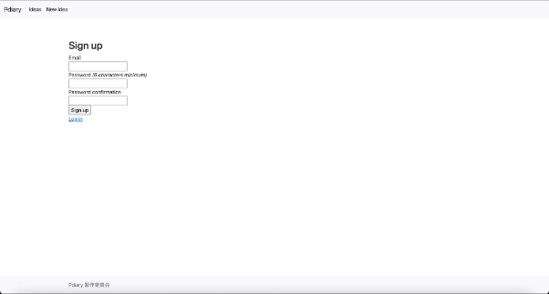
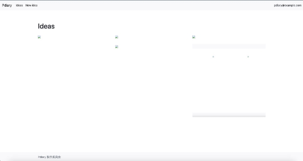

# ログイン機能を完成させよう

　前節では、deviseのインストール・セットアップ・ユーザー情報を管理するテーブルの作成、 deviseとユーザー情報の紐付けを行いました。ここから、deviseで自動生成された画面を確認し ながら、ログイン機能を完成させていきましょう。

## ログイン画面を確認しよう

　Webサーバーを起動して、ログイン画面にアクセスしてみましょう。


　これはdeviseが用意してくれているログイン画面で、次の項目が表示されています。

- メールアドレス入力欄
- パスワード入力欄
- ログイン状態を保持するチェックボックス
- ログインボタン
- ユーザー情報画面へのリンク
- パスワード変更画面へのリンク

　ですが、今の状態でログインしようとしてもユーザー情報が登録されておらず、一致するユーザーが見つからないためログインできません。

## ユーザー情報を登録して、ログインしてみよう

　それではユーザー情報を登録して、ログインの確認をしてみましょう。ログイン画面のSign upリンクをクリックします。



　この画面もdeviseが用意してくれている画面です。次の項目が表示されています。

- メールアドレス入力欄
- パスワード入力欄
- パスワード確認用入力欄
- ユーザー登録ボタン
- ログイン画面へのリンク

　メールアドレス・パスワードに入力する値については、次の点に注意してください。


|項目|説明|
| - | - |
|メールアドレス|新規に登録するユーザーのメールアドレスを入力します。このメールアドレスは、すでに登録されている他のユーザー情報のメールアドレスと重複しないメールアドレスでなければいけません。|
|パスワード|パスワードを６文字以上で入力します。|
|パスワード確認用|パスワードに入力した文字と同じ文字を確認のために入力します。|

　では、ユーザー登録をしていきましょう。それぞれの欄に記入します。Sign Upボタンをクリックしたら、一覧画面に「Welcome! You have signed up successfully.」というフラッシュメッセージが表示されます。これは、ユーザー登録に成功し、pdiaryにログイン済みの状態になっていることを表します。

## ログイン情報を表示しよう

deviseが持っているログイン済みユーザー情報を知ろう

　Chapter5-1でdeviseのインストール・セットアップ、deviseとユーザー情報の紐付けを行っただけで、ユーザー登録・ログイン機能は簡単に完成しました。

　deviseは、ログイン済みユーザー情報も簡単に取得できます。current\_userというメソッドを呼び出すと、ログイン済みユーザー情報を返します。未ログインの場合には、nilを返します。current\_userで取得したユーザー情報は、次の項目を持っています。

- メールアドレス
- 暗号化されたパスワード
- パスワードリセット時のトークン
- パスワードリセットメールの送信日時
- ログイン状態作成日時

　ログイン済みユーザーが誰かわかるように、メールアドレスをpdiaryに表示させましょう。app/views/layouts/application.html.erbを開き、次のように変更します。

```html
<nav class="navbar navbar-expand-lg bg-light">

  <div class="container-fluid">

    <a class="navbar-brand" href="#">Pdiary</a>

    <button class="navbar-toggler" type="button" data-bs-toggle="collapse" data-bs-target="#navbarNav" aria-controls="navbarNav" aria-expanded="false" aria-label="Toggle navigation">

    <span class="navbar-toggler-icon"></span>

    </button>

    <div class="collapse navbar-collapse" id="navbarNav">

      <ul class="navbar-nav me-auto mb-2 mb-lg-0">

        <li class="nav-item">
          <a class="nav-link active" aria-current="page" href="/ideas">Ideas</a>
        </li>

        <li class="nav-item">
          <%= link\_to "New idea", new\_idea\_path, class: "nav-link active" %>
        </li>

      </ul>

      <ul class="nav">

        <li class="nav-item">

          <% if current\_user.present? %>

            <%= current\_user.email %>

          <% end %>

        </li>

      </ul>

    </div>

  </div>

</nav>
```

　current\_userは、未ログインの場合には、nilを返すと説明しました。ユーザー情報の項目にはemailの情報がありますが、nilは何も持っていないため、エラーになってしまいます。そこで、current\_userが値を返す場合のみ、current\_user.emailを呼び出す必要があります。

　ここでは、ifという条件分岐を使って、current\_user.emailを呼び出すかどうかを判定しています。ifの後ろに書いてある式（条件）がtrue・真を返す場合に、if - end内に書いた処理が実行されます。条件分岐については7章でも説明します。

　では、表示されているか確認してみましょう。



参考書籍

江森真由美，やだけいこ，小林智恵. (2023/4/20). はじめてつくるWebアプリケーション 〜Ruby on Railsでプログラミングの第一歩を踏み出そう. ISBN: 978-4-297-13468-6
