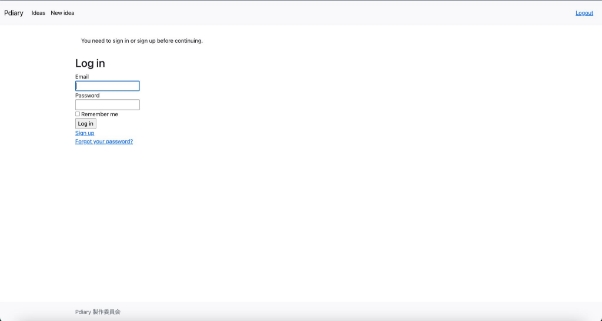
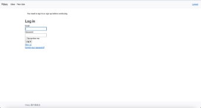
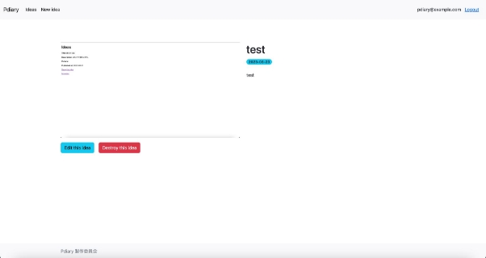

# ログイン済みユーザーだけが日記を

## 投稿・編集できるようにしよう

　ログイン済みのユーザーがどうかのチェックは、まだどの画面でも行われておらず、同じこと（投稿など）ができる状態です。そこでログイン済みユーザーだけが、日記の投稿・編集を行えるようにしましょう。

### 投稿画面を設定しよう

　まずは、投稿画面をログイン済みユーザーだけがアクセスできるように設定してみましょう。app/controllers/ideas\_controller.rbをエディターで開き、次のように変更します。

```ruby
class IdeasController < ApplicationController

before\_action :authenticate\_user!, only: :new

before\_action :set\_idea, only: %i[ show edit update destroy ]
```

　追加した１行は、「投稿画面を表示する処理の前に、authenticate\_user!メソッドを呼び出す」という定義になります。具体的には、before\_action :authenticate\_user!は「IdeaControllerに定義されたアクションを呼び出す前にauthenticate\_user!を実行する」となります。そして、only: :newは、「IdeasControllerに定義されたnewメソッドを呼び出す場合に」という条件になります。

　なお、authenticate\_user!は、ログイン済みどうかを確認して、ログイン済みの時は何もせず、未ログインの時はログイン画面を表示するdeviseのメソッドです。これで、投稿画面にアクセスしようとした時に、ログイン済みの場合は投稿画面が表示され、未ログインの場合はログイン画面が表示されるようになります。



　ログアウトした状態で投稿画面を開くとログイン画面が開きます。


　ログインすると投稿画面が表示されるようになります。

### 編集画面を設定しよう

　先ほど投稿画面を変更して、ログイン済みユーザーだけが日記を投稿できる状態になりました。しかし、まだ編集画面の設定はできていません。試しに未ログインの状態で、一覧画面で表示されている画像をクリックして参照画面を表示します。「Edit this idea」ボタンをクリックすると、編集画面を表示して内容を編集できます。

　そこで、先ほどと同じように編集画面もログイン済みユーザーだけが利用できるように、合わせて日記の削除もログイン済みユーザーだけができるようにしてみましょう。app/controllers/ideas/controller.rbを開き、先ほどの行を変更します。

```ruby
class IdeasController < ApplicationController

before\_action :authenticate\_user!, only: [:new, :edit, :destroy]
before\_action :set\_idea, only: %i[ show edit update destroy ]
```

　「先ほどのコントローラーのnewメソッドを呼び出す場合に」という条件に、編集画面を表示するeditメソッド、削除処理を行うdestroyメソッドも条件に追加しました。

　実際に試してみましょう。ログアウトした状態で、参照画面にある「Edit this idea」ボタンをクリックして次のようにログイン画面が表示されたら成功です。




　ログインすると編集画面が表示されるようになります。

### ナビゲーションバーを設定しよう

　ナビゲーションバーの右側には、ログイン済みの時だけメールアドレスが表示されるので、ログイン済みかどうかはわかるようになっています。しかし、ログインするためには、ナビゲーションバーにある「New idea」リンクをクリックしてログイン画面を表示する必要があります。ログイン済みの時は「Logout」リンクを、未ログインの時は「Login」リンクが表示されるようにして、簡単にログイン・ログアウトできるように変更してみましょう。app/views/layouts/application.html.erbを開き、次のように変更します。

```html
<span class="navbar-text pull-right">

  <% if user\_signed\_in? %>

    <%= button\_to "Logout", destroy\_user\_session\_path, method: :delete, data: { turbo: false }, class: "btn btn-link" %>

  <% else %>

    <%= link\_to "Login", new\_user\_session\_path, class: "btn btn-link" %>

  <% end %>

</span>
```

　user\_signed\_in?は、ログイン済みどうかを確認するメソッドで、ログイン済みの時はtrueを、未ログインの時はfalseを返します。ログイン済みの時は「Logout」リンクを、未ログインの時は「Login」リンクが表示されるように変更します。

 

### ログインしていないときの参照画面を設定しよう

　参照画面に「Edit this idea」ボタン、「Destroy this idea」ボタンがありますが、これをログイン済みの時は表示し、未ログインの時は表示しないように変更します。app/views/ideas/show.html.erbを開き変更します。

```html
<%= render @idea %>

<% if user\_signed\_in? %>

  <div class="btn-toolbar">

    <%= link\_to "Edit this idea", edit\_idea\_path(@idea), class: "btn btn-info" %>

    <%= button\_to "Destroy this idea", @idea, method: :delete, class: "btn btn-danger ms-3" %>

  </div>

<% end %>
```

未ログインの場合


ログイン済みの場合



　これでログイン済みユーザーだけが日記の投稿・編集ができるようになり、未ログインユーザーは日記を見ることだけができるようになりました。

参考書籍

江森真由美，やだけいこ，小林智恵. (2023/4/20). はじめてつくるWebアプリケーション 〜Ruby on Railsでプログラミングの第一歩を踏み出そう. ISBN: 978-4-297-13468-6
